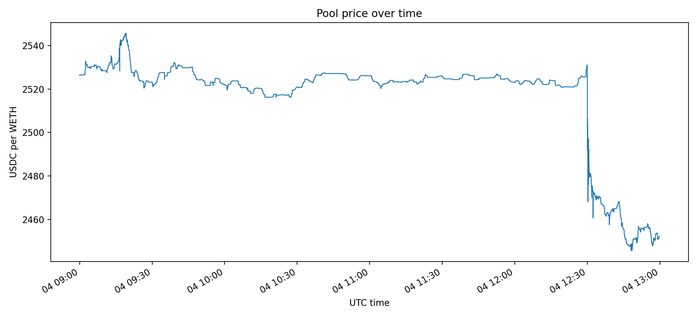
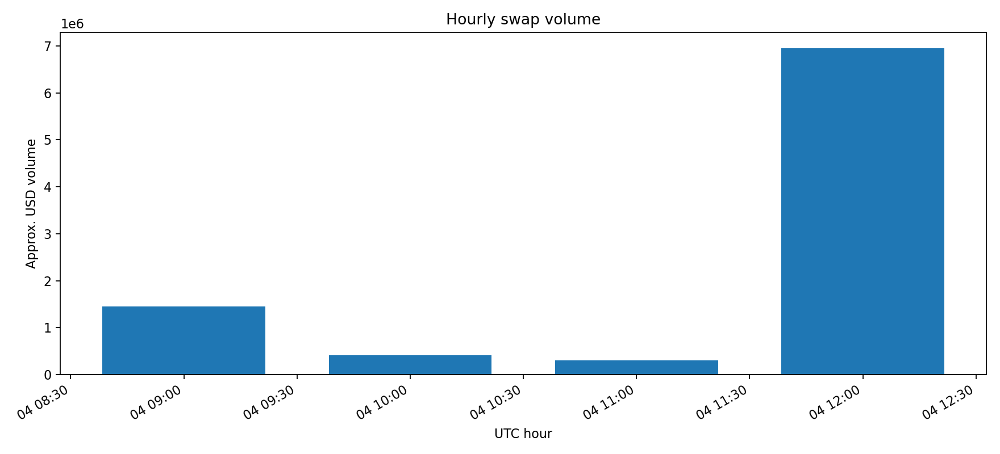
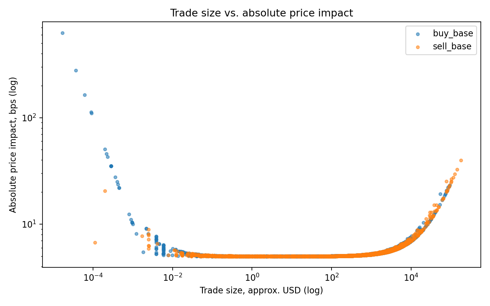
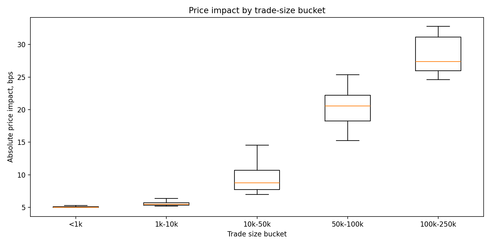
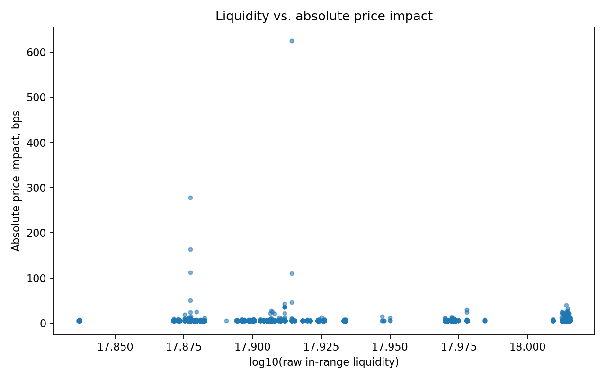

# Base Uniswap V3 Price Impact Discovery

This project answers the Lindenshore blockchain data discovery prompt with a small, reproducible on-chain dataset: recent `Swap` events from a Base Uniswap v3 WETH/USDC pool, stored locally in SQLite and analyzed for trade size, liquidity, price movement, and price impact.

The RPC endpoint is intentionally not committed. Add your own free Base RPC URL to `.env`:

```bash
BASE_RPC_URL=https://your-base-rpc.example
```

## Project Overview

The research question is:

> On Base Uniswap v3 WETH/USDC, how do trade size, direction, and in-range liquidity relate to realized price impact, and can large-impact swaps surface useful execution-risk or arbitrage/MEV signals?

The project is intentionally scoped to one active pool so the methodology is auditable. It can later be extended to multiple fee tiers, pools, or chains.

## Dataset and Pool Selection

Formal analysis scope used for this submission:

- Network: Base mainnet
- Protocol: Uniswap v3
- Pool: `0xd0b53D9277642d899DF5C87A3966A349A798F224`
- Pair: WETH/USDC
- Fee tier: `500` (0.05%)
- Block range: `50861527` to `50868726`
- UTC window: `2026-09-04 09:00:00` to `2026-09-04 12:59:59`
- Beijing time window: `2026-09-04 17:00:00` to `2026-09-04 20:59:59`
- Storage: SQLite at `data/swaps.db` locally; generated summary/charts are included in this repo

Default configurable scope:

- Pair: WETH/USDC
- Fee tier: `500` (0.05%)
- Lookback: recent 7 days, if your RPC can support the request volume

Uniswap v3 has separate pools per fee tier, so the project includes a pool discovery command before collection:

```bash
base-v3-discover-pool --recent-blocks 43200
```

This compares the `100`, `500`, `3000`, and `10000` fee tiers by recent Swap count, current liquidity, and current WETH/USDC pool price. Use the most active pool/fee tier for the final dataset.

Official Base Uniswap v3 deployment references:

- Factory: `0x33128a8fC17869897dcE68Ed026d694621f6FDfD`
- Base WETH: `0x4200000000000000000000000000000000000006`

## Data Collection Method

`base-v3-fetch-swaps` reads Swap logs with `eth_getLogs`, decodes the Uniswap v3 event fields, caches block timestamps, and inserts records into SQLite with a `tx_hash + log_index` primary key.

Collected fields:

- pool address
- block number and timestamp
- transaction hash, transaction index, log index
- sender and recipient
- `amount0` and `amount1`
- `sqrtPriceX96`
- in-range `liquidity`
- `tick`

The fetcher supports:

- chunked log requests
- retry with backoff
- automatic chunk-size reduction if RPC rejects a range
- resume progress by pool/range
- SQLite de-duplication

Alchemy's free Base tier currently limits address-filtered `eth_getLogs` calls to 10 blocks per request, so the default `LOG_CHUNK_SIZE` is set to `10`. The fetcher can run several 10-block requests in parallel with `--workers`; keep this modest on free RPC tiers.

## Price Impact Methodology

Uniswap v3 `Swap` emits the pool price after the swap. The analysis therefore approximates pre-swap price as the previous Swap event's post-swap price for the same pool.

For each swap:

```text
raw_price = (sqrtPriceX96 / 2^96)^2
adjusted_token1_per_token0 = raw_price * 10^(token0_decimals - token1_decimals)
execution_price = abs(quote_amount / base_amount)
price_impact = (execution_price - pre_swap_pool_price) / pre_swap_pool_price
```

For WETH/USDC, the project normalizes prices to:

```text
USDC per WETH
```

Direction is interpreted from pool deltas:

- `sell_base`: pool receives WETH and sends USDC
- `buy_base`: pool sends WETH and receives USDC

## Setup

```bash
cd /home/leo/base-uniswap-v3-impact
python3 -m venv .venv
. .venv/bin/activate
pip install -e .
cp .env.example .env
# edit .env and fill BASE_RPC_URL
```

Or use the shared conda environment on this machine:

```bash
conda activate shared_env
cd /home/leo/base-uniswap-v3-impact
pip install -e .
# edit .env and fill BASE_RPC_URL
```

You can also install from `requirements.txt`:

```bash
pip install -r requirements.txt
```

## How To Run

1. Compare fee-tier pools:

```bash
base-v3-discover-pool --recent-blocks 43200
```

2. Fetch recent swaps. The default uses WETH/USDC 0.05% for the last 7 days:

```bash
base-v3-fetch-swaps
```

Useful overrides:

```bash
base-v3-fetch-swaps --fee 500 --days 7 --chunk-size 10 --workers 4 --progress-every 50
base-v3-fetch-swaps --pool 0xYourPoolAddress --from-block 123 --to-block 456
base-v3-fetch-swaps --max-swaps 20000
```

3. Run quality checks:

```bash
base-v3-quality-check
```

4. Generate analysis outputs:

```bash
base-v3-analyze
```

Outputs:

- `data/swaps.db` local SQLite database, ignored by git
- quality-check console report
- `output/swaps_enriched.csv` local enriched CSV, ignored by git
- `output/summary.md` tracked formal summary
- `output/charts/price_timeseries.png`
- `output/charts/hourly_volume.png`
- `output/charts/size_vs_impact.png`
- `output/charts/impact_by_size_bucket.png`
- `output/charts/liquidity_vs_impact.png`

## Results and Charts

Formal run results are saved in `output/summary.md` and the chart files under `output/charts/`.

Dataset quality checks passed for the formal window:

- Raw swaps: 4,677
- Analyzable swaps: 4,677
- Swaps with pre-swap price impact: 4,676
- Duplicate `tx_hash + log_index` rows: 0
- Missing timestamps: 0
- Zero amount rows: 0
- Same-sign `amount0/amount1` rows: 0
- Direction counts: 2,457 buy-WETH swaps and 2,220 sell-WETH swaps
- Post-swap price range: 2,445.657252 to 2,545.677513 USDC/WETH











## Findings

During the selected 4-hour window, the WETH/USDC 0.05% pool processed 4,677 swaps with about $9.12M of quote-side volume. The median swap size was only $321.56, which shows that most flow in this sample was small, frequent activity rather than a handful of very large trades.

Absolute price impact was low for the majority of swaps: mean impact was 5.803 bps, median impact was 5.099 bps, and the 95th percentile was 6.630 bps. The maximum observed impact was much larger at 625.000 bps, so tail events exist even when typical execution cost is small.

Trade size is where the pattern becomes more informative. Median absolute impact was 5.032 bps below $1k, 5.462 bps for $1k-$10k, 8.767 bps for $10k-$50k, 20.559 bps for $50k-$100k, and 27.381 bps for $100k-$250k. In this sample, price impact starts to rise visibly once swaps reach roughly the $10k-$50k bucket.

Raw in-range liquidity did not explain much variation in this 4-hour sample. For trades above the median size, low-liquidity periods had median impact of 5.292 bps versus 5.440 bps in high-liquidity periods. That suggests size was a clearer driver than the raw liquidity field in this short window.

All top-decile size swaps were followed by an opposite-direction swap within five minutes. This is a useful candidate signal for arbitrage or MEV review, but it is not proof on its own; Base WETH/USDC is active enough that opposite-direction flow can also appear naturally.

## Potential Applications

This dataset can be applied to:

- execution-risk estimation for large Base WETH/USDC swaps
- monitoring low-liquidity windows
- alerting on unusually large price-impact trades
- finding candidate arbitrage or MEV follow-up cases
- comparing execution quality across Uniswap v3 fee tiers or chains

## Limitations

- The first swap in the sample is skipped for price-impact calculations because it has no previous in-sample price.
- The previous-Swap pre-price approximation can miss price changes caused by Mint/Burn activity or long quiet periods.
- Raw Uniswap v3 liquidity is useful as a relative in-range liquidity signal, not a direct USD liquidity measure.
- Single-pool Swap data can identify suspicious patterns, but cannot by itself prove arbitrage or MEV.

## Optional Quote Tool

The repository still includes the earlier single-swap quote helper as a side utility:

```bash
base-v3-quote --token-in WETH --token-out USDC --fee 500 --amount-in 1
```

The assessment deliverable should rely on historical Swap collection and analysis, not this quote helper.

## Sources

- Uniswap Base v3 deployments: https://developers.uniswap.org/docs/protocols/v3/deployments/v3-base-deployments
- Uniswap v3 Swap event fields: https://github.com/Uniswap/v3-core/blob/main/contracts/interfaces/pool/IUniswapV3PoolEvents.sol
- Ethereum JSON-RPC log querying: https://ethereum.org/developers/docs/apis/json-rpc/
